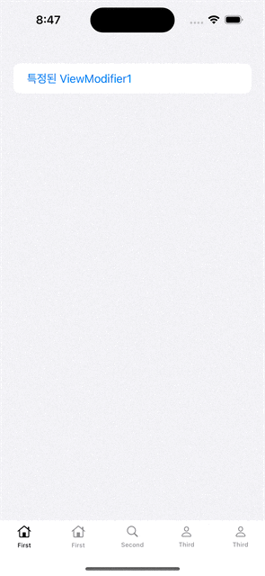

# CustomTabView (WMTabView)

**[코드](https://github.com/dev-wimes/ScratchPad-SwiftUI/tree/a8cd10b7c3c775419a54d61d5cb6362dfbb0ba24/ScratchPad-SwiftUI/ScratchPad-SwiftUI/Content/WMTabView)**

## 개요

SwiftUI용 custom TabView이다.

사용 방법은 다음과 같다.

```swift
@State private var selection: Int = 0
@State private var isShow: Bool = true

var body: some View {
  WMTabView(selection: self.$selection, isShow: self.$isShow) {
    ContentView()
    	.wmTabItem(index: 0, icon: Image("..."), title: "first")
    NavigationView {
      NavigationLink("navigate to") {
        InsideView()
      }
    }
    .wmTabItem(index: 1, icon: Image("..."), title: "second")
  }
  // Tab의 style을 변경하고자 하는 경우
  .wmTabViewEnableColor(.green)
  .wmTabViewDisableColor(.black)
  .wmTabItemStyle(WMTabItemTestStyle())
  .wmTabViewStyle(WMTabViewTestStyle())
}

/* InsideView */

struct InsideView: View {
  // Tab에서 전개된 View에서 tab의 visibility를 변경하고자 하는 경우
  @Environment(\.wmTabVisibility) var tabVisiblity

  var body: some View {
    Button {
      print("tapped!")
      self.tabVisiblity.wrappedValue = !tabVisiblity.wrappedValue
    } label: {
      Text("tab toggle")
    }
  }
}
```



## 설계

## 구현

## 후기

