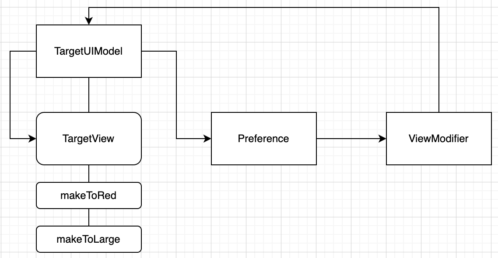

# TargetedModifier1

**[전체 코드](https://github.com/dev-wimes/ScratchPad-SwiftUI/tree/7db0dc852354f9d95728e3a8ce4272d11bcf3f62/ScratchPad-SwiftUI/ScratchPad-SwiftUI/Content/TargetedViewModifier1)**

## 개요

SwiftUI에서 Custom한 View를 만들기 위해서는 새롭게 View를 만드는 방법도 있지만, 유연하게 chaining 방식으로 View를 구성할 수 있다.

`ViewModifier`를 사용하면 되는데, 일반적으로 `ViewModifier`를 사용하게 되면 다음과 같이 코드를 작성할 것이다.

아래는 특정 input값이 invalid하다면 내부의 color 전체를 변경해주는 View와 ViewModifier이다.

```swift
struct InvalidTextField: View {
  @Binding var text: String
  var body: some View {
    TextField("input text", text: $text)
  }
}

extension View {
  // 유효하지 않는 경우에 대한 Color를 정의
  func invalidColor(_ color: Color) -> some View {
    return modifier(InvalidColorModifier(color))
  }
}

struct InvalidColorModifier: ViewModifier { ... }
```

위 경우 원하는 View를 얻을 수 있지만 어느 `View` type이 건간에 `invalidColor(_:)` 메서드를 사용할 수 있다.

`InvalidTextField`에서 사용하라고 만든 메서드인데 쌩뚱맞게 `Text` 에도 invalidColor가 적용될 수 있다.

 즉, 개발자가 일일히 신경 쓰면서 어떤 메서드를 써야하고 쓰지 말아야 할지를 생각해야 한다.

SwiftUI 기본 modifier를 보면 `ScrollView` 에서 `font(_:)`메서드를 사용한다고 해서 `ScrollView` 자체에 font가 적용되지 않는다.

하위 스코프에 있는 View들 중 font를 정할 수 있는 View들만 적용된다.

```swift
struct ContentView: View {
  var body: some View {
    ScrollView {
      LazyVStack {
        Text("Hello") // title 폰트가 적용된다.
        Rectangle() // 폰트 적용이 되지 않는다.
      }
    }
    .font(.title)
  }
}
```

이러한 동작을 Custom한 View에서도 동작되게 하는 것이 목표이다.

다음과 같이 말이다.

```swift
struct ContentView: View {
  var body: some View {
    Group {
      TargetedModifier1View() // makeToRed, makeToLarge 적용
      Text("otherView") // makeToRed, makeToLarge "적용되지 않음"
    }
    .makeToRed()
    .makeToLarge()
  }
}
```


## 설계

`Preference`와 `ViewModifier`를 사용한다.

`ViewModifier`는 View의 형태를 변형하고, `Preference`는 하위 뷰에서 상위 뷰로 데이터를 전달하기 위한 방법이다.

`Preference`의 value가 변경되면 상위 뷰에 있는 `onPreferenceChange`의 closure가 호출된다.

이를 이용해 다음과 같은 형태의 메커니즘을 설계한다.



1. `TargetView`에 `@OvervedObject var model: TargetUIModel = .ini()`을 작성하고, View에 `model`의 `Published`프로퍼티를 바인딩한다.
2. `TargetView`에서 `TargetUIModel`가 변경되면 Preference가 동작하도록 바인딩한다.
3. `TargetUIIModel`이 변경되면 Preference는 미리 등록해둔  `ViewModifier`의 `onPreferenceChange`의 closure를 호출한다.
4. `ViewModifier`는 closure를 통해 받은 `model`을 변경한다.
5. `model`이 변경되면서 `TargetView`가 변경된다.

## 개발

**TargtedViewModifier1UIModel**

```swift
final class TargetedModifier1UIModel: ObservableObject, Equatable {
    static func == (lhs: TargetedModifier1UIModel, rhs: TargetedModifier1UIModel) -> Bool {
        lhs.color == rhs.color
        && lhs.font == rhs.font
    }
    
    @Published var color: Color = .black
    @Published var font: Font = .body
    
    init() { print("init \(String(describing: self))")}
    deinit { print("deinit \(String(describing: self))") }
}
```

`color`와 `font`의 데이터를 갖고 있고, 이를 리엑티브하게 데이터를 전달하기 위해 `@Published`로 선언한다.

`Equatable`채택의 이유는 `Preference`에서 value의 변경을 감지하는데, 여기서 value가 `TargetedViewModifier1UIModel`이기 때문이다.


**TargetedViewModifier1PreferenceKey**

```swift
struct TargetedModifier1PreferenceKey: PreferenceKey {
    static var defaultValue: TargetedModifier1UIModel { .init() }
    
    static func reduce(value: inout TargetedModifier1UIModel, nextValue: () -> TargetedModifier1UIModel) {
        value = nextValue()
    }
}
```

`TargetedModifier1UIModel`이 변경되면 Preference가 동작하도록 한다.


**TargetedModifier1ColorModifier**, **TargetedModifier1FontModifier**

```swift
struct TargetedModifier1ColorModifier: ViewModifier {
    private let color: Color
    init(color: Color) { self.color = color }
    
    func body(content: Content) -> some View {
        content
            .onPreferenceChange(TargetedModifier1PreferenceKey.self) { model in
                model.color = self.color
            }
    }
}

struct TargetedModifier1FontModifier: ViewModifier { ... }

extension View {
    func makeToRed() -> some View {
        modifier(TargetedModifier1ColorModifier(color: .red))
    }
    
    func makeToLarge() -> some View {
        modifier(TargetedModifier1FontModifier(font: .largeTitle))
    }
}
```

ViewModifier에선 `onPrefrenceChange`를 통해 model의 프로퍼티를 변경해준다.


**TargetedViewModifier1View**

```swift
struct TargetedModifier1View: View {
    @ObservedObject var model: TargetedModifier1UIModel = .init()
    
    var body: some View {
        Group {
            Text("MyView")
                .preference(key: TargetedModifier1PreferenceKey.self, value: self.model)
                .foregroundColor(self.model.color)
                .font(self.model.font)
        }
    }
}
```

View에서는 MyView 라는 text가 화면에 노출되고 model의 프로퍼티에 따라서 font와 color가 변경된다.

`preference`를 통해 model을 PreferenceKey의 value로 등록한다.

model이 변경될 때 마다 `TargetedModifier1PreferenceKey`의 Preference가 동작한다.( 이부분 잘 이해가 안가는데 일단, 코드는 의도한대로 동작하는데 왜 성공하는지 잘모르겠음. view를 생성하는 시점에서는 model이 변경되지 않고 생성만되는데... 왜 onPreferenceChange의 클로저가 호출되서 동작하는지 잘모르겠음. )


## 후기

SwiftUI에서 View에 대해 modifier 메서드 제약을 거는 방법은 여러가지가 있는데, (위의 내용말고도 protocol과 WrappingView를 이용한 방법, Custom View 내부 메서드를 통해 새로운 View를 리턴하는 방법) 

그중 제일 깔끔하고 SwiftUI스러운 방법을 사용해봤다.