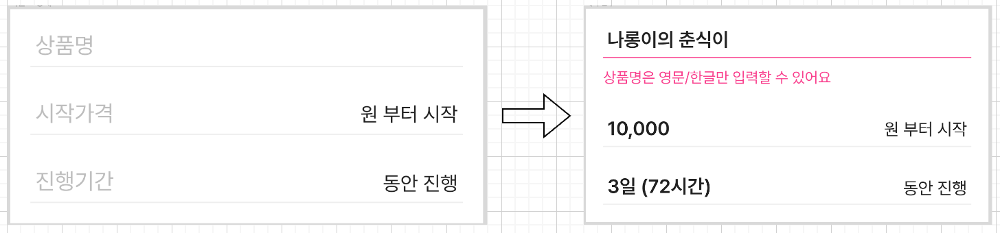
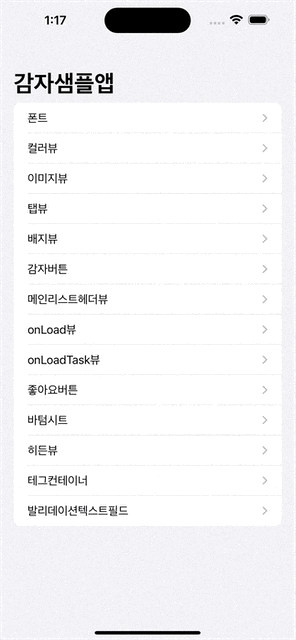

# ValidationTextField 

**[코드](https://github.com/dev-wimes/ScratchPad-SwiftUI/tree/main/ScratchPad-SwiftUI/ScratchPad-SwiftUI/Content/ValidationTextField)**

## 개요

피쳐의 궁극적인 목표는 다음과 같은 기능과 UI/UX를 갖는데에 있습니다.

* TextField에 문자열을 쓸 수 있다.
  * 이때 문자열을 입력할 때 divider의 색상은 진하게 변한다.
* input 받은 문자열이 invalid 하다면 다음과 같은 UI가 노출된다.






## 사용

```swift
ValidationTextField(
  isValid: .init(get: { self.text.isEmpty }, set: { _ in }), // 유효성 검사를 위한 파라미터
  text: self.$text, // input받을 text 변수를 전달
  placeHolder: "holder" // TextField의 placeholder
) { label in // label은 (String) -> InvalidLabelView 타입의 클로저
   // invalid 이벤트가 발생했을 때 노출되는 문구(에러문구)를 정의
   label("invalid invalid invalid invalid invalid invalid")
   .invalidFont(.title) // 에러 문구에 대한 font
   .spacingWithHorizontal(16) // 에러 문구와 ValidationTextField 사이의 가로 inset
   .lineLimit(2) // 에러 문구의 line limit
}
.invalidColor(GamzaUIKit.Color.subBlue) // invalid 이벤트가 발생했을 때 포인트 컬러 (divider, 에러문구)
.dividerSpacing([.bottom], 20) // divider 기준으로 bottom spacing. 즉, divider - InvalidLabelView 사이의 spacing
.dividerSpacing([.top], 10) // divider 기준으로 top spacing
```


## 구현

### ValidationTextField

우선 init부터 보겠습니다.

```swift
public struct ValidationTextField<Content: View>: View {
  // ...
  private let placeHolderText: String
  private let label: ((String) -> InvalidLabelView) -> Content

  public init(
    isValid: Binding<Bool>,
    text: Binding<String>,
    placeHolder: String,
    @ViewBuilder label: @escaping ((String) -> InvalidLabelView) -> Content
  ) {
    self._isValid = isValid
    self._text = text

    self.placeHolderText = placeHolder
    self.label = label
  }
// ...
```

* isValid: 유효성 검사를 위한 파라미터
* text: input받을 text Binding
* placeHolder: TextField의 placeholder
* label: 유효하지 않을 시 노출되는 Label을 만들어주는 closure
  * String을 파라미터로 받고 invalid text로 활용한다.
  * return 값은 InvalidLabelView 타입으로서 제약된 메서드만 사용할 수 있도록 한다. (InvalidLabelView에 허용된 메서드만 사용한다.)


다음으로 View입니다.

```swift
public var body: some View {
  VStack(spacing: 0) {
    TextField("", text: self.$text)
    .autocorrectionDisabled(true)
    .placeHolder(when: self.text.isEmpty) {
      self.PlaceHoldText(self.placeHolderText)
    }
    .lineLimit(1)
    .pretendardFont(self.font)
    .foregroundColor(self.textColor)
    .focused(self.$isFocus)

    self.DividerView(
      isFocus: self.isFocus,
      isValid: self.isValid,
      invalidColor: self.invalidColor
    )
    .padding(.bottom, self.dividerBottomSpace)
    .padding(.top, self.dividerTopSpace)

    if !self.isValid {
      self.label { text in
        InvalidLabelView(text: text, invalidColor: self.invalidColor)
      }
    }
  }
}
```

* TextField

  ```swift
  TextField("", text: self.$text)
      .autocorrectionDisabled(true)
      .placeHolder(when: self.text.isEmpty) {
        self.PlaceHoldText(self.placeHolderText)
      }
      .lineLimit(1)
      .pretendardFont(self.font)
      .foregroundColor(self.textColor)
      .focused(self.$isFocus)
  ```

  기본 TextField에 PlaceHold 부분을 "" 으로 아무것도 나오지 않게 했습니다.

  이유로는 SwiftUI에서 기본적으로 지원해주는 TextField는 placehold font나 컬러를 커스터마이징할 수 없기 때문입니다.

  대신에 `placeHolder(when:alignment:placeHolder:)`메서드를 새로 만들어서 커스터마이징 할 수 있도록 했습니다.

  ```swift
  extension View {
    func placeHolder(
      when isShow: Bool,
      alignment: Alignment = .leading,
      @ViewBuilder placeholder: () -> some View
    ) -> some View {
      ZStack(alignment: alignment) {
        if isShow {
          placeholder()
        }
        self
      }
    }
  }
  ```

  또한 `fouced(_:)` 메서드를 이용해 TextField가 활성화 여부를 `isFocus` 변수에 바인딩했습니다.

  `isFocus` 변수를 이용해 TextField가 활성화 여부에 따른 동작을 구현할 수 있습니다.

  

* DividerView

  `isFoucs`, `isValid`에 따라서 Divider의 색상이 변경되도록 했습니다.

* label

  label은 invalid일 때 노출되며 closure 호출 시 `InvalidLabelView`를 생성합니다.


다음으로 ValidationTextField modifier 메서드 제약 부분입니다.

```swift
public struct ValidationTextField<Content: View>: View {
  // ...
  public enum DividerEdge {
    case top
    case bottom
  }

  private var dividerTopSpace: CGFloat = 0
  private var dividerBottomSpace: CGFloat = 0
  private var font: PretendardFont = GamzaUIKit.Font.size18.weight(.regular)
  private var textColor: Color = GamzaUIKit.Color.gray900
  private var invalidColor: Color = GamzaUIKit.Color.pointPink
  
  // ...
  public init( ... ) { ... }

  public var body: some View { ... }
}
```

앞서 설명했듯이 `init`에 들어가는 파라미터들은 `ValidationTextField`를 구성하는데 있어서 필수적인, 또는 변하지않는 요소들을 init의 파라미터로 받도록 했습니다.

그 외에 `ValidationTextField` 에서 유동적으로 변하는 속성값들은 method를 이용해 변경을 할 수 있도록 했습니다.

modifier를 제공하기 위해 `extension View`에 `ViewModifier` 를 사용해도 되지만, `ValidationTextField`에서 제공해주는 method말고는 사용할 수 없도록 만들고 싶었습니다.

이를 위해선 속성값들은 private var로 선언하고 기본값들을 지정해줍니다.

그리고 아래 method들을 정의합니다.

```swift
public extension ValidationTextField {
  func dividerSpacing(_ edges: [DividerEdge], _ lenght: CGFloat) -> Self {
    var view = self
    if edges.contains(.top) {
      view.dividerTopSpace = lenght
    }

    if edges.contains(.bottom) {
      view.dividerBottomSpace = lenght
    }

    return view
  }

  func font(_ font: PretendardFont) -> Self {
    var view = self
    view.font = font
    return view
  }

  func textColor(_ color: Color) -> Self {
    var view = self
    view.textColor = color
    return view
  }

  func invalidColor(_ color: Color) -> Self {
    var view = self
    view.invalidColor = color
    return view
  }
}
```

가장 간단한 메서드인 `font(_:)` 를 보면 `self`를 `view` 값에 의한 복사를 합니다.

`view`의 font 프로퍼티를 전달받은 파라미터값으로 변경합니다.

`view` 를 return합니다.

이렇게 하면 font속성이 새롭게 정의된 view를 생성하게됩니다. 

**기존에 `SwiftUI.View`에서 제공해주던 modifier method들은 사용할 수 없기에 안정성이 보장됩니다. 개발자가 의도한 대로 View를 만들 수 있습니다.**